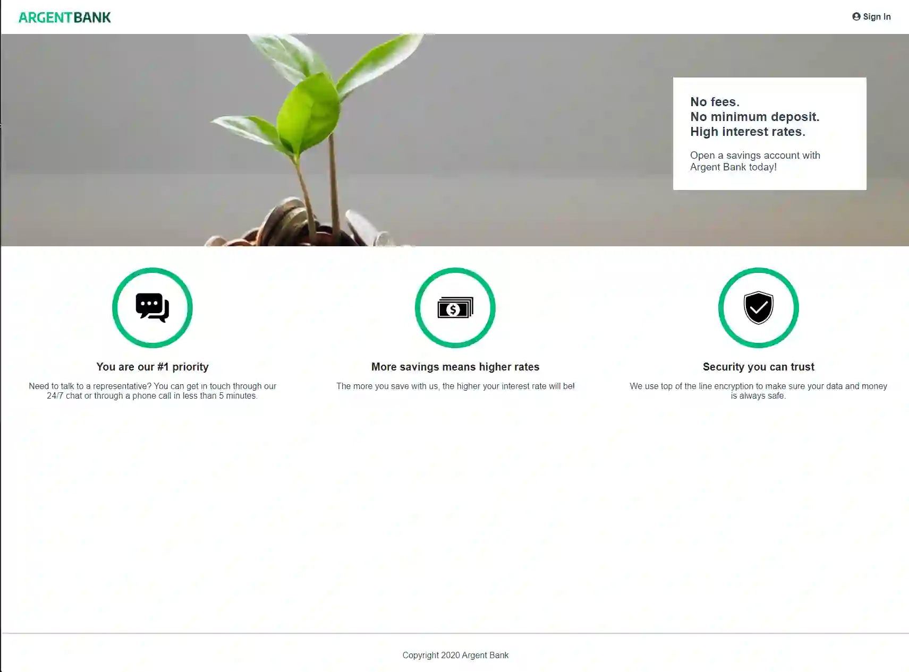
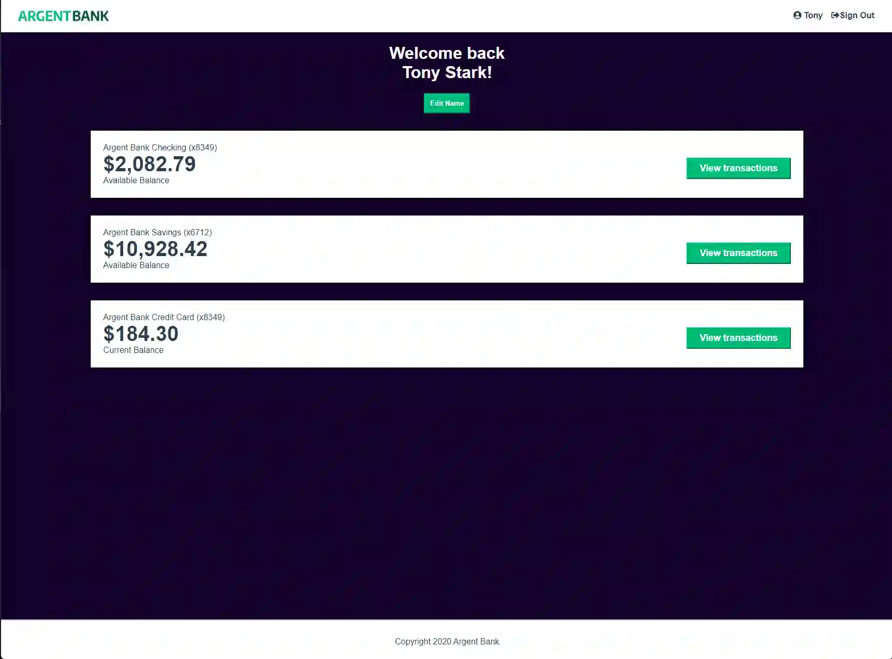
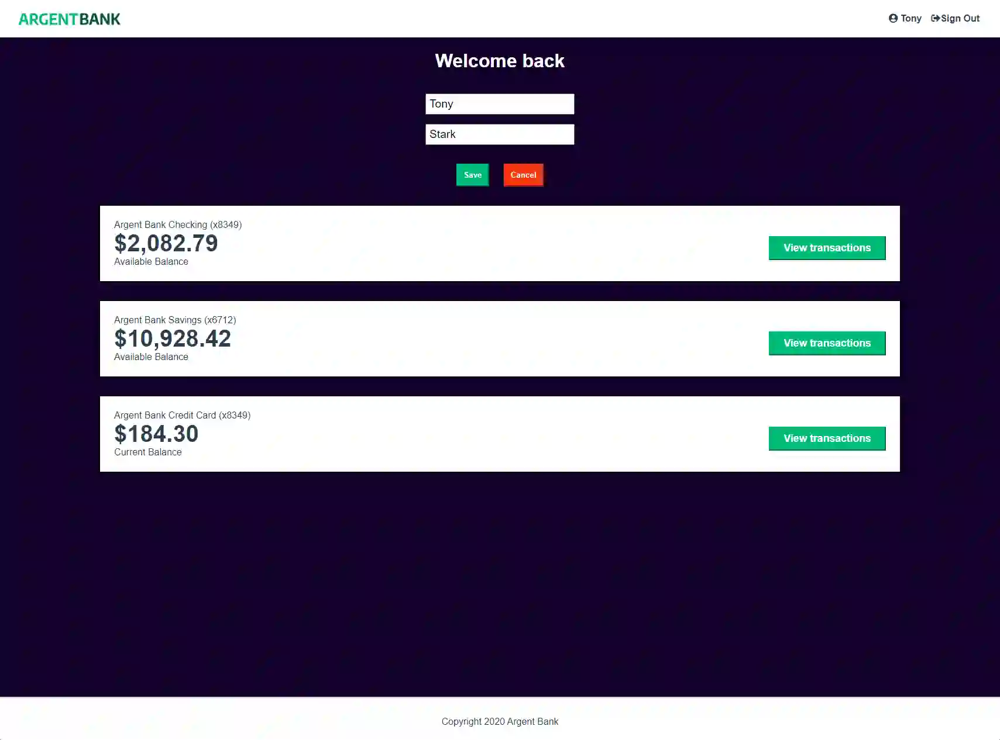
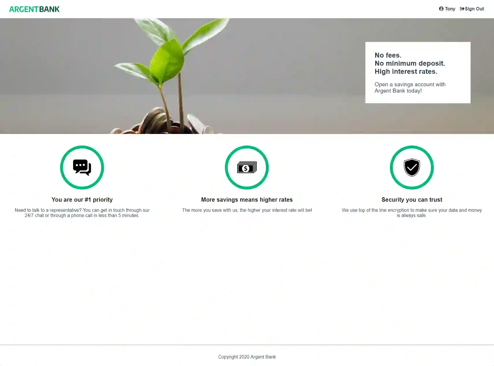

# ARGENT BANK


[](https://www.linkedin.com/in/alec-remond/)

Project 13 from JavaScript React developper path at OpenClassrooms

## First clone the project and launch backend

```bash
git clone https://github.com/rockethelll/P13-Docker-Backend
cd P13-Docker-Backend
docker-compose up --build -d
```

## Launch frontend

```bash
git clone https://github.com/rockethelll/P13-Argent-Bank
cd P13-Argent-Bank
npm install
npm run dev
```

You can see the site at : <http://localhost:5173>

## Login/password

```bash
tony@stark.com
password123
```

```bash
steve@rogers.com
password456
```

## Testing the application

Tests end to end are used to check the application with cypress:

- Access to home page
- Access to signin page
- Login and redirect to profile page
- Check the edit button
- Navigate to home page
- Logout

```bash
npm cy:open
```

## Tech Stack

**Client:** React, Redux, SCSS

**Server:** Node, Express

## Screenshots






